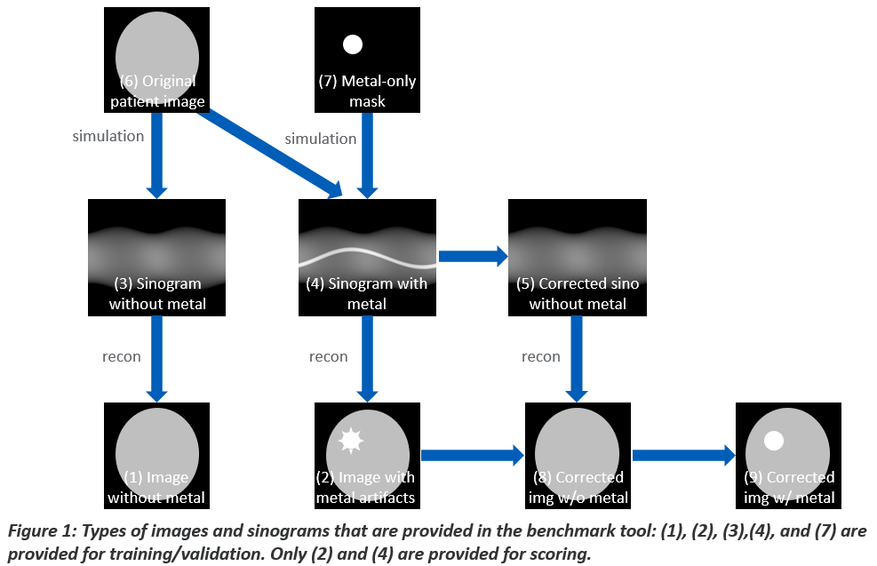

## Benchmark Tool Overview
The AAPM CT-MAR GC Benchmark tool includes:

* Training/validation datasets
* Scoring datasets
* Scoring program

### Training/validation datasets
Training/Validation datasets with 14,000 cases (1,773 head + 12,227 body) are provided for training and validation for your algorithm development. Each case includes 5 types of data as illustrated in Figure 1:

(1) image without metal (label)  
(2) image with metal (corrupted)  
(3) sinogram without metal (label)  
(4) sinogram with metal (corrupted)  
(7) metal-only mask & material info  

Although the labels do not contain metals in the training/validation datasets, **the final result that the you generate should be an image without any metal artifacts but that still contains the metal object (9) in Figure 1.** You can choose to develop image-domain, sinogram-domain, or hybrid MAR methods. For example, an image-domain method could generate (1) from (2) directly. A sinogram-domain method could generate (3) from (4) and then use the reconstruction routine to generate (1). A hybrid method could start from (4) and perform sinogram-domain operations, reconstruction, and image-domain operations to achieve (1), possibly in an iterative reconstruction framework. A standard 2D filtered back projection (FBP) reconstruction routine are provided in Python so that the participants do not need to develop their own reconstruction method (unless their MAR approach were to include a new reconstruction method). **Note that the reconstruction field-of-view (FOV) for body data should be 400 mm, and the one for head should be 220.16 mm over 512x512 pixels. You can set the reconstruction FOV by choosing body option for body dataset and head option for head dataset.** Since the final image should still contain the metal object, you may need to estimate the contour of the metal object and reintroduce the metal object in the end.

### Scoring datasets and scoring program
**scoring datasets** with 29 cases are provided along with a Python-based scoring program. In the scoring datasets, only input images (2) and sinograms (4) will be shared; Labels will not be shared. **The final result that the you generate is an image without any metal artifacts but that still contains the metal object (9).** Make sure to use the provided recon FOVs in mm, specified in README.txt in the datasets, if you reconstruct images from the sinograms. You will run the scoring program on their MAR processed images. 8 image quality metrics will be computed for each case and averaged in the scoring program. 
