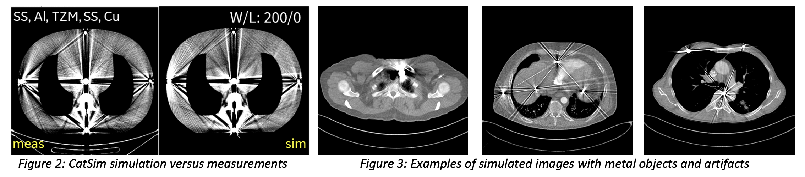
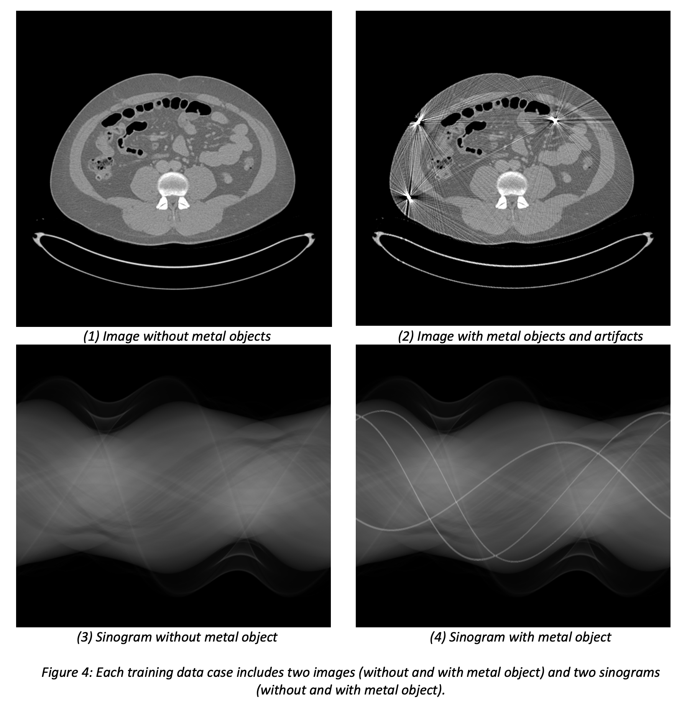

## Data generation

### Introduction
The root causes of CT metal artifacts are well understood and include beam hardening, scattered radiation, noise associated with photon starvation, aliasing, and non-linear partial volume effect [1,2]. To generate a large set of clinically realistic training data pairs, including corrupted input sinograms, artifact-free label sinograms, and the corresponding reconstructed images, we use a hybrid data simulation framework based on our CT simulation tool CatSim [3,4]. The hybrid data framework combines clinical patient images and virtual metal objects as the input to the simulation tool. We have developed realistic CT physics models that match real CT scanners in terms of spectrum shape, [5], spatial resolution [6], and sinogram and image noise [7]. When applied to metal objects we also observed highly realistic metal artifacts (Figure 2). The next sections describe the patient images, the metal objects and the CT physics models in more detail.

### Clinical patient images
Patient images for different anatomies were collected from the NIH DeepLesion dataset [8] (lung, abdomen, liver, head, and pelvis images) and from the UCLH Stroke EIT Dataset (head images) [9]. A moderate frequency boosting filter was applied to the patient images prior to CT simulation, to compensate for the spatial blur associated with simulation and reconstruction. As a result, simulated and reconstructed images without virtually inserted metal objects were visually undistinguishable from the original clinical images. Patients with minimal residual metal and/or artifacts (5 to 30 voxels) were included in the patient cohort to improve robustness of the training data. For the training of algorithms sensitive to this, the affected slices can be excluded via a provided list.

### Metal objects
Metal masks were defined as random shapes synthesized by generating vertices of a random fractal shape. A hexagonal shape is first initialized; the midpoints along each edge are then perturbed with a random gain. The random gain is uniformly sampled from the interval +/- (0.67 * length of the edge where the point is being inserted). The value of 0.67 is a value that provides a relatively continuous shape - higher values can give rise to isolated islands while lower values are too simple. This process is repeated over the edges until the length of the new edges corresponds to a pixel size where any further subdivision will be extraneous.  
To produce reasonably smooth edges, the vertex coordinates are eventually convolved with a moving average filter. The length of the moving average filter is calculated by selecting an exponent from the uniform distribution of 2.15 to 2.7 with the length of the filter being 10^(exponent value) or between 141 and 500.  The logarithm of the length of the moving average filter is uniformly distributed.  Here the values of 2.15 and 2.7 are selected heuristically based on shape complexity. The resulting metal masks are binary images of size 256x256. An effective diameter $d$ (in pixels) is computed based on $A$ the number of non-zero pixels in the mask: $d = 2*\sqrt{\frac{A}{\pi}}$. To simulate metal objects of a given average diameter $D$ (in mm), the CT simulation assigns a pixel size of $\frac{D}{d}$ to the metal mask. The metal objects are inserted in random soft tissue or bone locations. The metal materials include amalgam, stainless steel, copper, Cobalt, and Titanium. CatSim uses the linear attenuation coefficients as defined by Geant4. To facilitate localization of the metal objects, we also generate a metal mask image with the same dimensions as the reconstructed images (512 x 512 matrix size and a 40 cm reconstruction field-of-view for body and a 22.16 cm reconstruction field-of-view for head).

### CT physics models
A nominal vendor-neutral CT geometry (not exactly matching any commercial CT scanner) was simulated using the following parameters: source-to-iso-distance 550 mm, source-to-detector distance 950 mm, 1.0 mm x 1.0 mm focal spot size, 1.0 mm x 1.0 mm detector cells with fill factor 90% x 90%, 1.25 detector quarter offset, 120 kVp tube voltage, 500 mA tube current, 1 detector row, 900 detector columns, 1000 views, a large bowtie filter, and realistic quantum noise, electronic noise, and beam hardening. A 3mm deep GOS scintillator was modeled, with 2%(2.5%) row(column) optical and 4.5%(4%) row(column) X-ray crosstalk, and electronic noise with standard deviation on the order of 2.5 X_rays. The source spectrum was sampled at 12 energies. Focal spot width, focal spot length, and gantry rotation were each sampled with 2 sample points, resulting in 8 sub-samples total. A distance-driven projector was used to model the finite detector cell size. Even though for this 2D study only 1 detector row was simulated, scattered radiation consistent with 64 detector rows was used. Water beam hardening correction was applied to all generated sinograms and the corresponding images were reconstructed by 3D filtered backprojection (FDK) using a standard reconstruction kernel.

Figure 3 shows examples of our generated hybrid data simulations from real patient images and virtual metal objects. Figure 4 shows an example of a set of images and sinograms that will be provided for training. 

### Scoring datasets
Unlike the training datasets with random metal objects, the scoring datasets is based on patient images acquired at the Massachusetts General Hospital and the metal object are manually designed and positioned to represent the most realistic anatomy and metal combinations (e.g. gold markers positioned in the prostate). More details on this are provided under the scoring metrics page.

#### References
[1] De Man, B., Iterative Reconstruction for Reduction of Metal Artifacts in Computed Tomography, Ph.D. Thesis, University of Leuven, 2001, https://perswww.kuleuven.be/~u0015224/publications/thesis_BrunoDeMan.pdf  
[2] De Man, B., et al., P., 1998, November. Metal streak artifacts in X-ray computed tomography: a simulation study. In 1998 IEEE Nuclear Science Symposium Conference Record. (Vol. 3, pp. 1860-1865). IEEE.  
[3] De Man, B., et al. CatSim: a new computer assisted tomography simulation environment. In Medical Imaging 2007: Physics of Medical Imaging (Vol. 6510, pp. 856-863). SPIE.  
[4] Wu, M., et al, “XCIST – an open access x-ray/CT simulation toolkit,” Phys. Med. Biol., 2022.  
[5] FitzGerald, P., et al, 2021. Semiempirical, parameterized spectrum estimation for x‐ray computed tomography. Medical physics, 48(5), pp.2199-2213.  
[6] Zhang, J., et al, 2023, Accurate modeling of CT spatial resolution with CatSim, Phys. Med. Biol. (pending).  
[7] Zhang, J., et al, 2024, Accurate modeling of CT noise with CatSim, Phys. Med. Biol. (pending).  
[8] NIH DeepLesion dataset. https://nihcc.app.box.com/v/DeepLesion  
[9] Goren, N., Dowrick, T., Avery, J., & Holder, D. (2017). UCLH Stroke EIT Dataset - Radiology Data [CT]. Zenodo. https://doi.org/10.5281/zenodo.1199398
